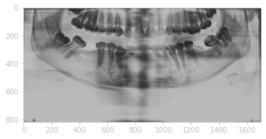
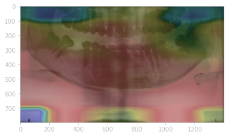

# GradCam (Gradient-weighted Class Activation Mapping)


Gradient-weighted Class Activation Mapping (Grad-CAM) is a technique for visualizing the important regions in an image that contribute to the prediction of a convolutional neural network. It uses the gradients of the target class flowing into the final convolutional layer to generate a coarse localization map. 


# Apply GradCAM technique on input images

Input: Original X-ray image of mandible bones

Output: The highlighted X-ray image with heatmap indicating the location of fracture

```
grad_model = tf.keras.models.Model([model.inputs], [model.get_layer('bn').output, model.output])

with tf.GradientTape() as tape:
    conv_outputs, predictions = grad_model(np.array([img]))
    loss = predictions[:,CLASS_INDEX]
    

output = conv_outputs[0]

grads =  tape.gradient(loss, conv_outputs)[0]


guided_grads = tf.cast(output > 0, 'float32') * tf.cast(grads >0, 'float32') * grads

weights = tf.reduce_mean(guided_grads, axis=(0, 1))

cam = np.ones(output.shape[0: 2], dtype = np.float32)

for i, w in enumerate(weights):
    cam += w * output[:, :, i]

cam = cv2.resize(cam.numpy(), (512, 512))
cam = np.maximum(cam, 0)
heatmap = (cam - cam.min()) / (cam.max() - cam.min())

cam = cv2.applyColorMap(np.uint8(255*heatmap), cv2.COLORMAP_JET)

output_image = cv2.addWeighted(cv2.cvtColor(img.astype('uint8'), cv2.COLOR_RGB2BGR), 0.8, cam, 0.5, 0.5)
img_resize = cv2.resize(output_image, (1400,800))
```
**Parameter**
- CLASS_INDEX : An index determines the fracture class name of mandible bones

**Input Example**
```img = cv2.imread(r'PATH OF THE IMAGE',0)
plt.imshow(img)
```


**Output Example**
```
plt.imshow(img_resize)
```

